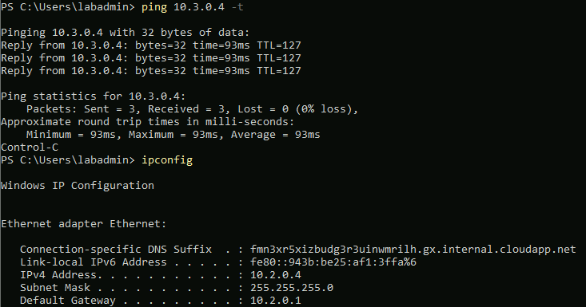
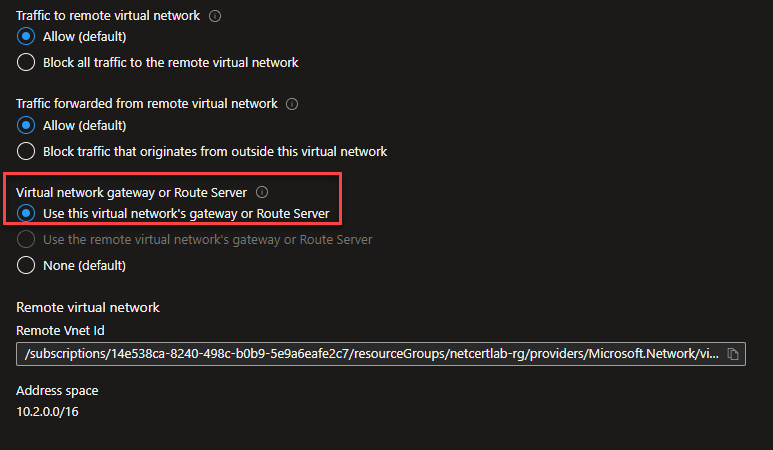
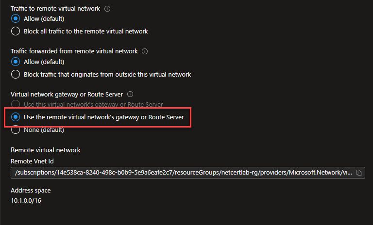
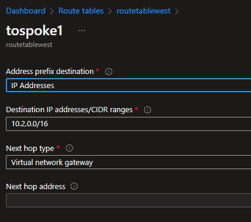

## Why this?

Glad you asked, several reasons:

1. Studying for the [AZ-700](https://docs.microsoft.com/en-us/learn/certifications/exams/az-700), the Azure networking exam, and figured I would do myself that which seems to have the status of slightly more complicated than hello-world in the Azure networking realm - user defined routing, traffic between spoke vNets through a hub vNet. The use case for this is that vNet peering by default does not enable this functionality and you may not want to configure direct peerings between the involved networks.
2. [In his Pluralsight course on this subject Tim Warner](https://app.pluralsight.com/paths/certificate/designing-and-implementing-microsoft-azure-networking-solutions-az-700) mentioned that the Virtual Network Gateway (VNG) can do the traffic forwarding function that usually the documentation says one needs an NVA (networking virtual appliance, a virtual firewall such as a Palo or similar) to handle. Not sure exactly where in the course, but it caught my attention, because in the simple mind of yours truly the math is simple: NVA = something external that I am responsible for and probably pay through the nose for and VNG = something that Microsoft has built into the platform, for which the costs are clear and my responsibility is near-none. Therefore, absent other factors, VNG > NVA. As I have not found this fact in the documentation so I figured I would see for myself.
3. The below picture is worth several hours of one's life.

Warning - I am not a networking person. At all. But this probably also good for anyone who is similarly not a networking person. If you see something wrong here please do not hesitate to say so.

## Lab Setup

We have the following setup. You may have similar setups in production because different services are primarily used from different regions, and they must talk to each other directly. This may also happen due to Landing Zone/s but it is my understanding that different zones/apps communicating with each other directly is a big no-no in that paradigm.

Hub vNet - East US - 10.1.0.0/16, has subnets:  
nva - 10.1.2.0/24  
GatewaySubnet - 10.1.3.0/24 - this one is specific to the Azure service, naming it anything will not work.  
AzureBastionSubnet - 10.1.4.0/24 - this one is specific to the Azure service, naming it anything will not work.

Spoke1 vNet - Central US - 10.2.0.0/16, has subnet:  
prod - 10.2.0.0/24  
has VM spoke1vm, IP 10.2.0.4

Spoke2 vNet - Central US - 10.3.0.0/16, has subnet:  
prod - 10.3.0.0/24  
has VM spoke2vm, IP 10.3.0.4

Peerings exist between hub and spoke 1 and hub and spoke2.  
A virtual network gateway is deployed into the Gateway subnet of hub. I used the VpnGw1 SKU.  
An Azure bastion is deployed into AzureBastionSubnet but this is just for convenience. It is, however, very convenient!

## The Goal

Get ping connectivity from spoke1vm to spoke2vm.

## Using the Virtual Network Gateway (VNG)

First, the spoke networks need to be configured to use the VNG in the hub network. This is also useful if your VNG in the hub network is your central point of connectivity to other things, such as on-premise networks or vendors or similar.

From hub to spoke1:

On the peering from hub to spoke1 we want this configuration

From spoke1 to hub:

On the peering from spoke1 to hub we want this configuration

Second, you are going to need Route Table resources, one per each region that your spoke networks are deployed to.

You are then going to need, in each Route Table, a custom route, like this:

This in effect says that for any IP within the "Destination IP addresses/CIDR ranges" provided, in our case here the spoke2 address range, the next network destination to go to is the VNG, on the presumption that the VNG knows what to do with the traffic after that.

You then configure the Route Table to apply to the subnet in question. If after applying the Route table to the relevant subnets this is still not working I would stop-start the Azure VMs (a reboot may or may not work, a stop-start always picks up such configuration changes).

You must do this for both of the spoke networks, since PING traffic needs to return, and it will not know how to return unless the other side has matching routing rules. I confirmed this by process of elimination and eventual realization, you do not have to.

## ETC. - You really want the NVA experience without the NVA complexity

It took me some doing to find this info, so here it is: [you can use a Windows server or Linux (in my test Ubuntu) VM.](https://www.expertnetworkconsultant.com/configuring/how-to-route-network-traffic-with-a-linux-network-virtual-appliance-on-azure/) You will need to enable IP forwarding on the vNIC.

Then, for Windows, assuming you have taken care of the firewall portion:  
Set-ItemProperty -Path HKLM:\\SYSTEM\\CurrentControlSet\\Services\\Tcpip\\Parameters -Name IpEnableRouter -Value 1

And for Linux:  
sudo sed -i 's/#net.ipv4.ip_forward=/net.ipv4.ip_forward=/' /etc/sysctl.conf sudo sed -i 's/net.ipv4.ip_forward=0/net.ipv4.ip_forward=1/' /etc/sysctl.conf sudo sed -i 's/#net.ipv6.conf.all.forwarding=/net.ipv6.conf.all.forwarding=/' /etc/sysctl.conf sudo sed -i 's/net.ipv6.conf.all.forwarding=0/net.ipv6.conf.all.forwarding=1/' /etc/sysctl.conf sudo sysctl -p

[Direct link to relevant part of relevant Microsoft document.](https://docs.microsoft.com/en-us/azure/virtual-network/tutorial-create-route-table-portal#turn-on-ip-forwarding-in-the-operating-system)
