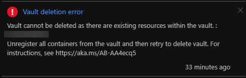
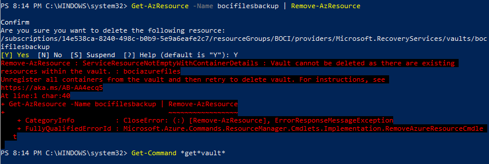

So I had a backup vault that was backing up an Azure Files share. From the Portal I [removed the share a protected item](https://docs.microsoft.com/en-us/azure/backup/backup-azure-delete-vault), so the backup vault now had no protected items. So now I should be able to delete the vault, right? Nope.



Vault cannot be deleted as there are existing resources within the vault: unregistered all containers from the vault and then try to delete the vault

So I took a look at the situation with PowerShell.



But it was not going to be that easy. It looks like there was something actually wrong.

So I had to set the storage vault context:

```
Set-AzRecoveryServicesVaultContext -Vault (Get-AzRecoveryServicesVault -Name yourvaultnamehere)
```

Determine if there is an offending container, possible types of containers are "AzureVM, Windows, AzureSQL, AzureStorage, AzureVMAppContainer":

```
Get-AzRecoveryServicesBackupContainer -ContainerType azurestorage
```

Save it to a variable, and unregister it:

```
$cont = Get-AzRecoveryServicesBackupContainer -ContainerType azurestorage
Unregister-AzRecoveryServicesBackupContainer -Container $Cont
```

And after that I was able to delete the backup vault as expected.
