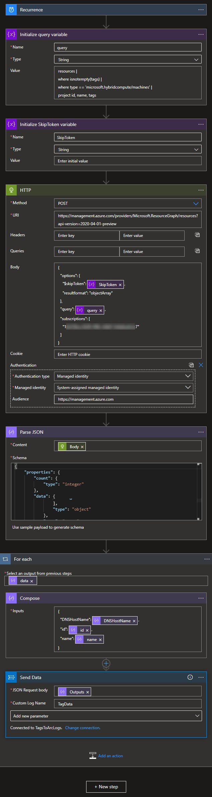
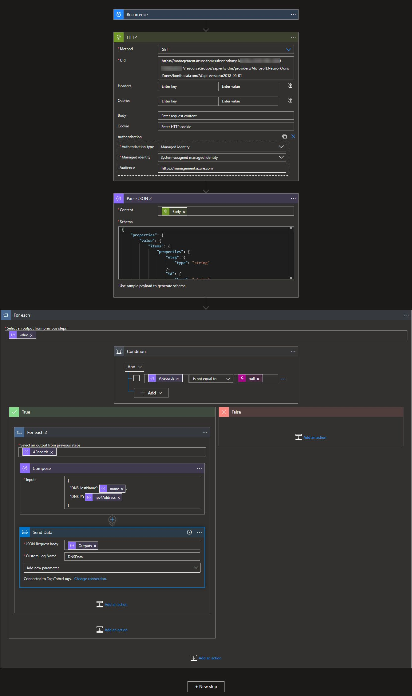
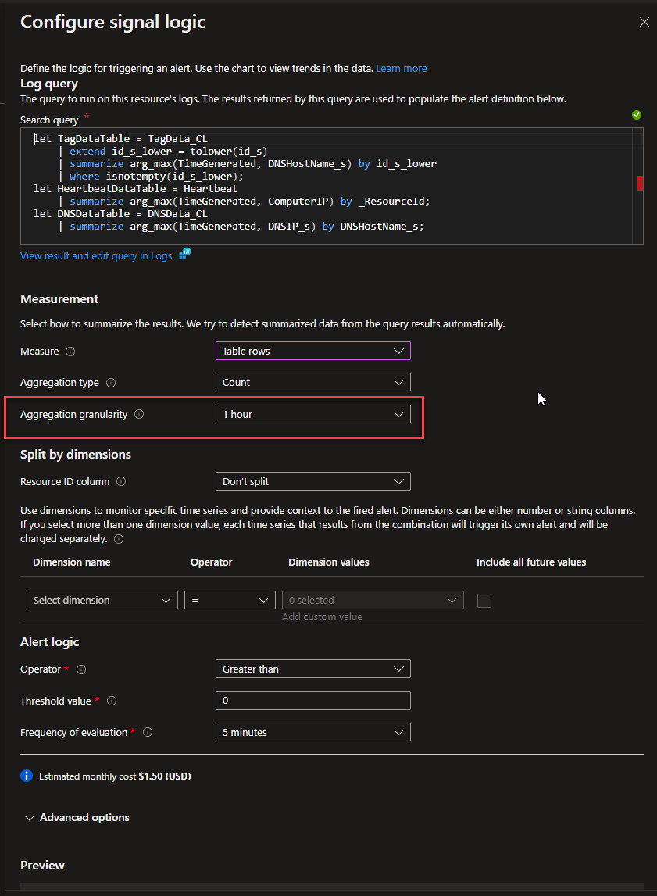
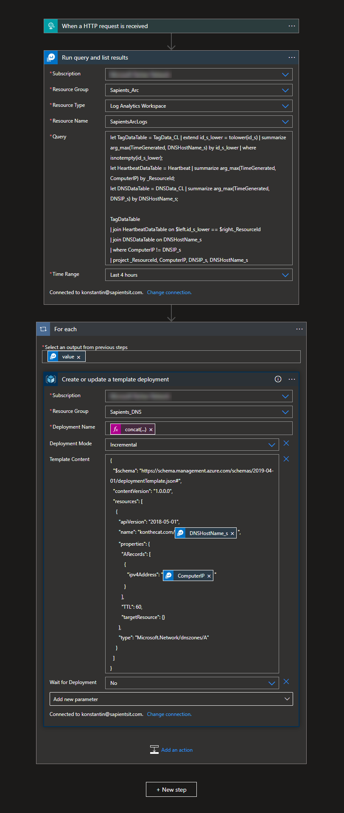

# Dynamic DNS in Azure v2: Heartbeat logs, Logic Apps, KQL - a concept

TL; DR - We take real public IP data from heartbeat logs of VM Insights. We also use Logic Apps to add in tag data, which connects computers with hostnames, as well as Azure DNS data, which gives us the DNS IPs for hostnames. Where we find that the heartbeat IP for a hostname no longer matches the DNS IP, we fix it by ARM template deployment from a Logic App.

## Preamble

The [previous version of dynamic DNS in Azure](https://blog.konthecat.com/dynamic-dns-with-azure-automation-rubook-hybrid-worker/) was fine. If anything, it was more straightforward than this. But this was never about doing dynamic DNS and always about getting deeper into what the platform is capable of, and arriving at solutions that are new and have that indescribable elegance about them.

The first step towards a new dynamic DNS solution came as a result of me playing around with Azure Arc. I could run a custom script with Arc. Ok, that is something. But what I also noticed fairly quickly when I deployed Insights is that the public IP gets sent with the heartbeat logs. Which means that you already have the public IP data you need, in Azure, as a part of built in functionality. So then a simple Azure Function or even Logic App, that just compares the heartbeat IP with the DNS IP would do, right? Yes, but we go down the KQL rabbit hole more completely instead.

## Requirements

1. Set up Azure Arc.
2. Set up Insights for hosts managed by Azure Arc.
3. Set up a public DNS zone in Azure.
4. Add tags to Azure Arc hosts to define DNS hostnames. This prevents you from having to do this configuration in a less elegant place such as the KQL query.

## In the end

In the end everything hangs on the below KQL query. This is used as the basis for the alert rule and the query is also executed in the Logic App that is triggered when the alert fires.

> let TagDataTable = TagData_CL | extend id_s_lower = tolower(id_s) | summarize arg_max(TimeGenerated, DNSHostName_s) by id_s_lower | where isnotempty(id_s_lower);  
> let HeartbeatDataTable = Heartbeat | summarize arg_max(TimeGenerated, ComputerIP) by \_ResourceId;  
> let DNSDataTable = DNSData_CL | summarize arg_max(TimeGenerated, DNSIP_s) by DNSHostName_s;
>
> TagDataTable  
> | join HeartbeatDataTable on $left.id_s_lower == $right.\_ResourceId  
> | join DNSDataTable on DNSHostName_s  
> | where ComputerIP != DNSIP_s  
> | project \_ResourceId, ComputerIP, DNSIP_s, DNSHostName_s

In this query we do the following things:

1. We define 3 data tables with the let statements:  
   a. TagDataTable - contains the most resent values of the DNSHostName tag value for all VMs that have this value defined, as well as the resource ID to enable joins with other data.  
   b. Heartbeat Data table - contains the most recent real IP address from the heartbeat logs and the resource ID.  
   c. DNS data table - contains the most resent IPs for hostnames from Azure DNS. These are the same hostnames as defined in the DNSHostName tag for the VMs in (a).
2. We then join the tag table with the heartbeat table by the resource ID, and the resulting table with the DNS data table by the DNS host name.
3. Finally, we output only the rows where the IP from heartbeat does not match the IP from DNS.

## Getting the Tag and DNS data into Log Analytics

You might ask, where does the tag and DNS data come from? Log Analytics does not, as of this writing, have direct access to information about Azure resources. This functionality is, per my reading of some forums, on endless backburner. So the data has to be fed in. Major inspiration was [this blog post here](https://medium.com/@deshantshukla/how-to-query-azure-resources-with-attached-resource-tags-9762508d3219). As I am only working with one resource, the Azure Arc representation of an on-prem computer, and separately with DNS records, my situation is simpler.

To send tag data to Log Analytics, we have the below. The schema for the JSON is nothing special, just the output based on a data sample provided by that step.

To send DNS data to Log Analytics, we have this Logic App below. The only tricky thing here was dealing with the 2 different kinds of A-records possible in an Azure DNS zone - the platform-maintained ones linked to a public IP resource and regular A records. To make the automatic schema generator produce a usable result I put the data for a regular A record first.

A note about the recurrence trigger - it is used out of sheer laziness. A more ideal combination would be based on the changes to the resources in question and then also daily or weekly, to ensure that there is data, as Log Analytics will purge stale data.

Also, while we are on the subject of getting data in. I have found that this process is not exactly perfect - the first one to two times I sent the data it disappeared without a trace - no error or anything - but a few minutes later the custom table was created and data began to be available.

## Alert Rule, Remediation

The only atypical thing with the Alert Rule is the Aggregation Granularity - this defines the extent to which the alert rule will look at past data. This needs to capture your Tag and DNS IP data. In my case I feed that data in every 30 minutes, so I look at the data for the past 1 hour, to ensure that I have data.

And the remediation Logic App is here below. What is interesting here is that the Alert Rule will actually send the query to the Logic App but for reasons not examined that is sent as an array rather than a single object, so it makes a needless for-each loop. I decided to just repeat the query.

## Summary

I hope you enjoyed this little exploration of the capabilities of the Azure platform. I am going to leave this running and will add notes here if this solution does not age well. I think it is helpful to know that such things are doable and are not difficult. Happy Azuring!
