# Dynamic DNS with Azure Automation Runbook Hybrid Worker

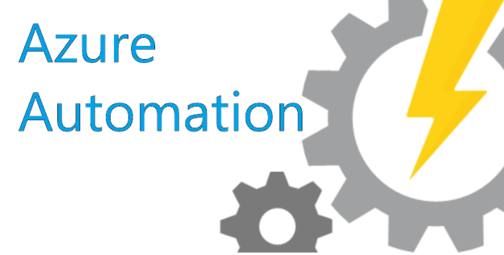

### TL;DR

Here we use an Azure Automation Hybrid worker to execute a runbook on a local computer whose public IP address we want to use to update an A record in Azure DNS. The main advantage of this approach is the monitoring and manageability one gets in effect for free with Log Analytics vs. doing this as a scheduled task on your local computer.

Motivation for this project is mostly getting deeper into the capabilites of Azure Automation for on-prem systems, and not paying for dynamic DNS.

### High Level Steps

1. Gather/set up the requirements
2. Connect Automation account to Log Analytics
3. Set up Automation account
4. Set up Hybrid Automation Worker
5. Import the certificate from Azure Automation into the hybrid worker
6. Set up run book that will do the dynamic DNS thing
7. Schedule the runbook that will do the dynamic DNS thing
8. Set up monitoring in Log Analytics

### Requirements

For this you will need:

- Azure subscription you have owner access to with:
  - A DNS zone already set up - [guide for that here](https://docs.microsoft.com/en-us/azure/dns/dns-delegate-domain-azure-dns). Create your A record that you want to update. Set the IP to 1.1.1.1 or some other nonsense.
  - Azure Automation account - just need to deploy one, will cover configuration below. Name as you want. Be sure to create run-as account, is required to access Azure resources, and we will need to access Azure DNS. Recomending something to do with the management of local systems for the name, since the hybrid automation worker will be tied to it, and it can do other things.
  - Log Analytics account - just need to deploy one, will cover configuration below. Name as you want.
- Computer on which to run Hybrid Worker. I am using Windows Server 2019 but a desktop OS should work as well.
- Some basic familiarity with PowerShell.

### Review of Azure Automation concepts

In case you are new to Auzre Automation, I give a brief intro to the core concepts of the service that we will be using.

- Azure Automation account - this is a container for all things Azure Automation. Runbooks, crendetials, schedules, hybrid workers, they are all tied to a specific Automation account.
  - Runbook - individual set of code. Can be PowerShell, Python or graphical.
  - hybrid worker or hybrid worker group - by default Automation runbooks run on hosts managed by Azure. With a hybrid worker you can run runbooks on hosts you control. These can be in Azure or on-premise, it does not matter. The group part of this simply refers to the ability to deploy the same worker on more than one host for resilliency.

### Connect Automation account to Log Analytics

It is a good idea to do this early on as sometimes it takes a while (20-60 min) for the logs to actually start streaming into Log Analytics.

In Azure Automation, find the "Diagnostic settings" blade. Add a diagnostic setting configured to send JobLogs, JobStreams, and AllMetrics to your Log Analytics account. Name the setting as desired, the name "setting" is popular.

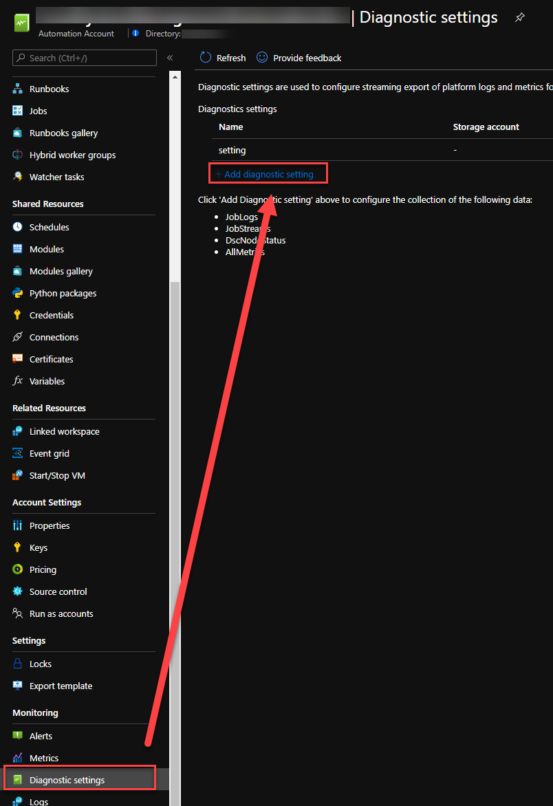  
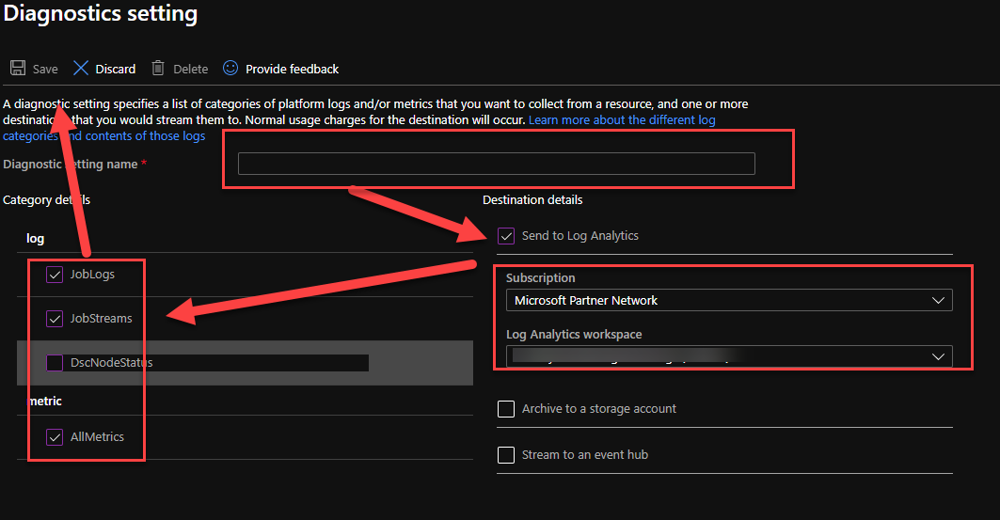

## Set Up Automation Account

The Automation account as deployed by default from Azure portal needs some additional modules - Az.Accounts, Az.Resources and Az.Dns. To install those click on Modules gallery, then search for them click on them, and click Import. You have to wait for Az.Accounts to finish before adding the other ones as they depend on Az.Accounts.

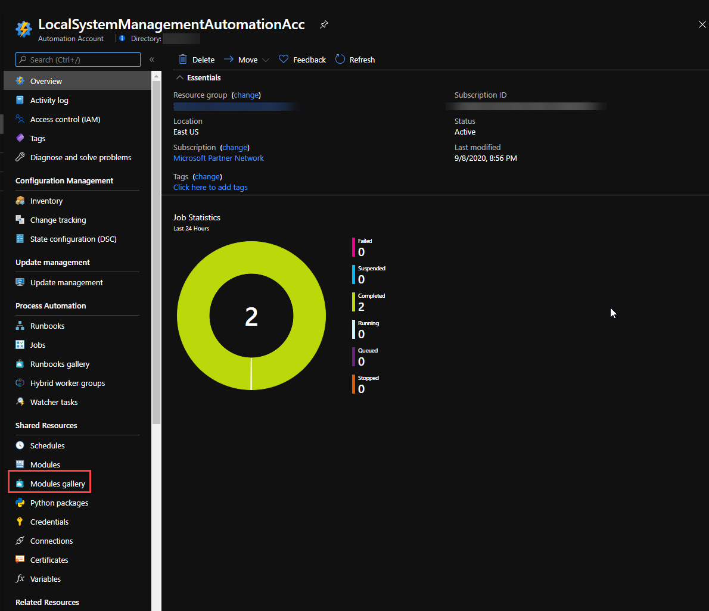

### Set up Hybrid Automation Worker

The easiest way to set up the worker is to follow the [automated deployment steps here](https://docs.microsoft.com/en-us/azure/automation/automation-windows-hrw-install#automated-deployment). They work, and the script gives you output that tells you what it is doing. For the parameters keep in mind that the HybridGroupName is what you will call the hybrid worker (or group if you will have more than one for resillency), so the name should be meanigful enough if you will have more than one site/group for whatever reason.

### Import the certificate from Azure Automation into the hybrid worker

This was the trickiest step for me - [you have to run the PowerShell referenced here in a runbook on your hybrid worker](https://docs.microsoft.com/en-us/azure/automation/automation-hrw-run-runbooks#runas-script), it will not work anywhere else. To do so you have to create your first runbook, and this will validate that your hybrid worker is working as expected.  
To create and execute your first runbook, do the following:

1. Find "Runbooks" on the main screen of the Azure Automationa account, click on that.
2. Click on Add.
3. Name your runbook. Something like "SaveRunAsCertToWorker" is a good idea. Set type to PowerShell. Click on Create on the bottom. You will get automatically loaded into the edit screen.  
   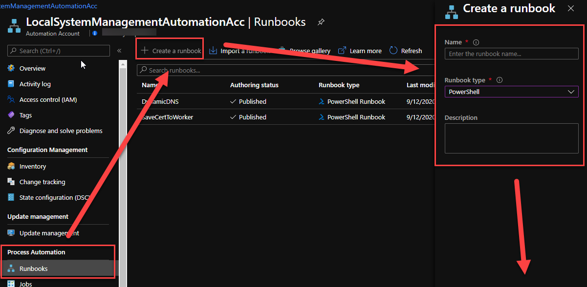
4. Copy-paste the code from the link above into the runbook. Click on Save, then on Publish, and Yes to accept the changes.  
   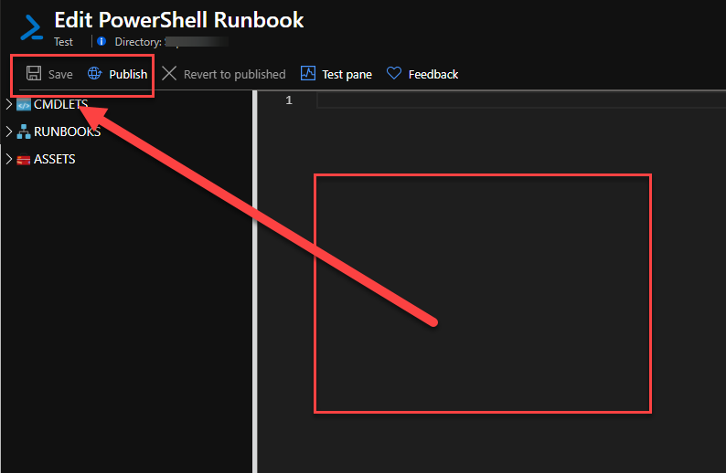
5. Click on Start, then switch the Run Settings to run on your hybrid worker, and click on ok. You can go get a drink of water or something, this takes a minute.  
   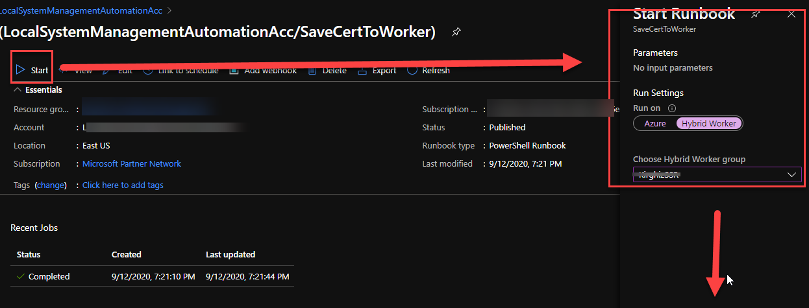
6. You can click refresh when the status changes to completed. Your output should look something like the below. If not, check the Errors tab and troubleshoot.  
   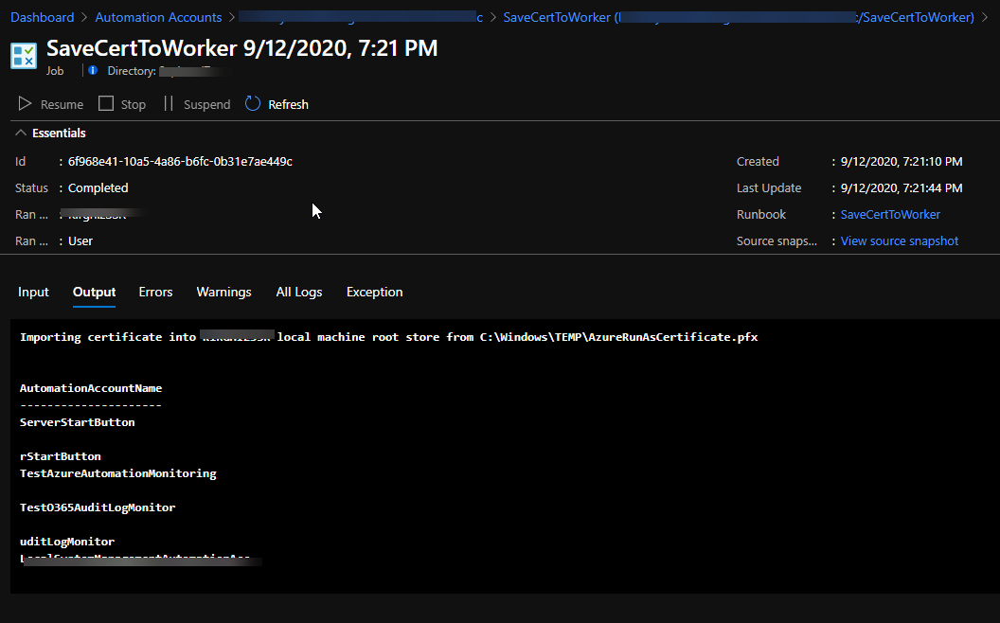

### Set up run book that will do the dynamic DNS thing

1. [Get the code from here.](https://github.com/KonTheCat/AzureAutomationStuff/blob/master/DynamicDNS.ps1)
2. Create runbook as above. Name it DynamicDNS or something similar. It uses parameters, so it is not tied to any one specific host or zone.
3. Run the runbook. You will notice that you now have to specify the host name and zone name as parameters. Your output should be something like the below.  
   Note - we are depending here on [https://ipinfo.io/](https://ipinfo.io/) allowing Azure Automation unauthenticated access.  
   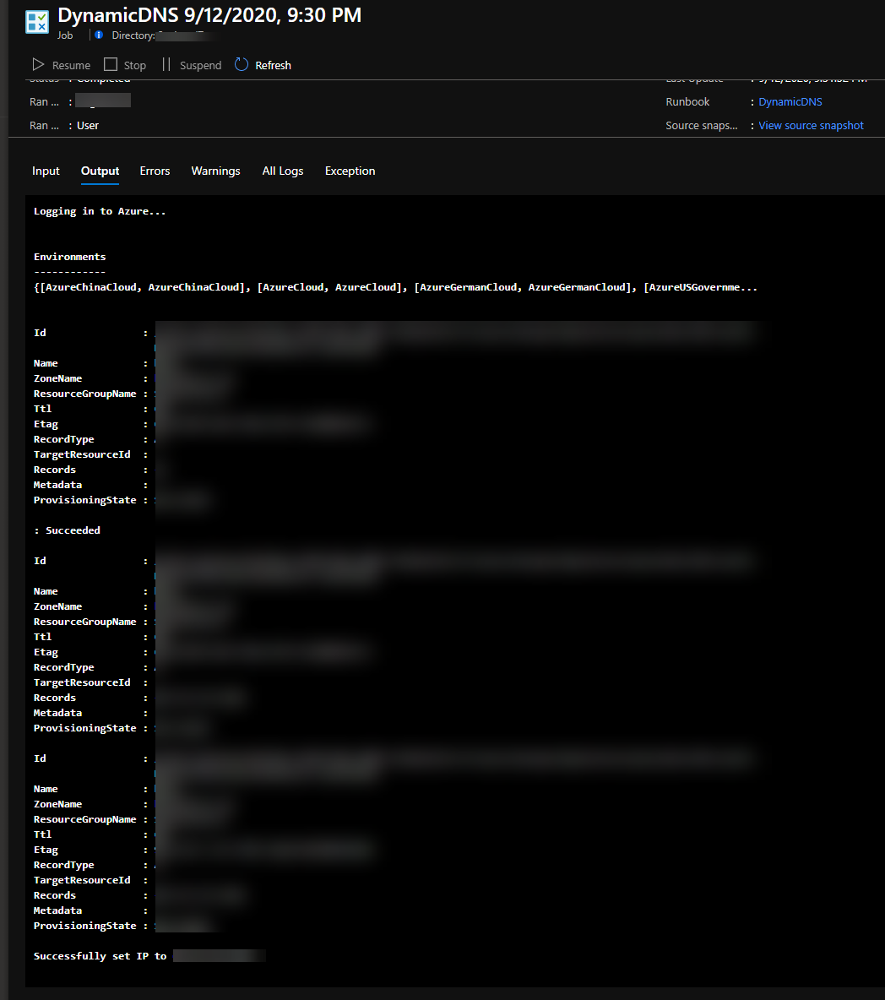

### Schedule the run book that will do the dynamic DNS thing

Now that your runbook works as expected, the next step is to link it to a schedule. The schedule link combines the time when you want the runbook to run, the parameters, and the hybrid worker you want it to run on, so it is here that you do your per-instance configuration. If you want more flexibility than what is offered by Automation account schedules you should use Logic Apps. [You can also trigger this with a webhook](https://docs.microsoft.com/en-us/azure/automation/automation-webhooks), that you run from a scheduled task on your local computer - not ideal, but can be monitored for.

1. Go over to your run book and click the "link to schedule" button. You will need to complete two elements:
   1. Create or select schedule. Fairly self-explanatory.
   2. Configure the paramaters and Run Settings - these are exactly the same settings you executed the runbook with above.
2. Click on Ok

### Set up monitoring in Log Analytics

This is what makes this solution better than just a scheduled script (other than that scheduled script probably has a harder time with secure storage of credentials for Azure). If you recall, one of the first things we did is send the logs from Azure Automation to Log Analytics. We will now do some very basic log analyzing, which will be the basis of our monitoring, which will trigger our alerting.  
Note: It sometimes takes Log Analytics a while to start getting logs from Azure Automation. I have seen this take an hour. If you do not see any logs when you reach this point try later.

There are essentially two conditions we want to monitor for:

1. Fail silent - there are no jobs running at all. Since you set up a schedule this should not happen, but who knows. This becomes much more important if you are triggering with a webhook from a local system, this is how you would monitor that.  
   Sample query - _AzureDiagnostics | where RunbookNames == "DynamicDNS" and ResultDescription contains "Job is started"_  
   For this query we will want to know when there are 0 results.
2. Errors in the execution of the runbook - self-explanatory. The PowerShell could do more, but it does not have to, at least until clear patterns of error are indentified.  
   Sample Query - _AzureDiagnostics | where RunbookNames == "DynamicDNS" and StreamTypes == "Error"_  
   For this query we will want to know when there is more than zero results.

The subject of Log Analytics is also well-covered in the Microsoft documentation so here we will do only the bare minimum. For each case we have a query, the below process will cover the first setup, you just repeat for the second.

1. Go to Log Analytics, click on logs, navigate through the popups until you get to the new query window.
2. Enter the sample query and select Run. You may or may not have results. You should have no results for the error condition if you did not encounter errors.  
   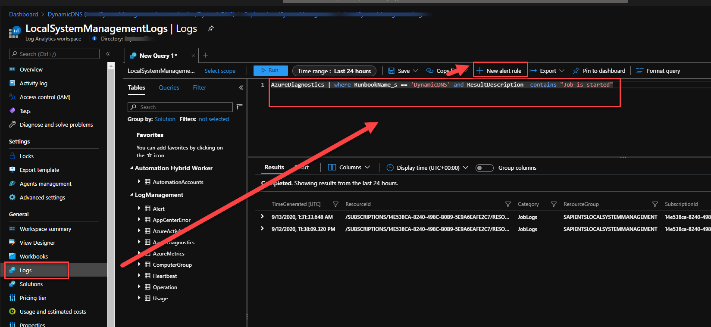
3. When satisifed with query results click on +New alert rule. Specify details with the following considerations:
   1. The frequency at which you scheduled your runbook to run will determine the frequecy with with you check status. I run once a day, so I check once a day.
   2. The Action group determines what happens when alert criteria are met. You can configure this as per your wishes, there are many different options (SMS, email, phone call, webhook, Logic App, etc).

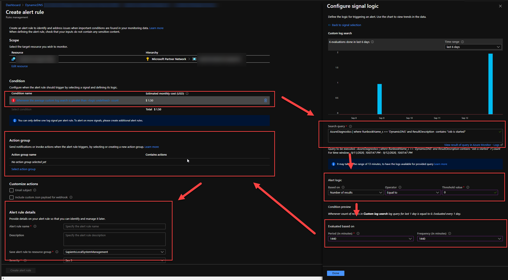

After you have done all that, you are done! You can now cancel your dynamic DNS service and consider how to re-use the resulting savings.
