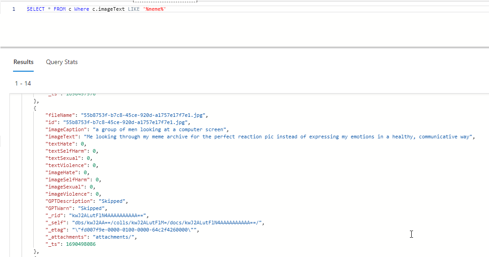

Today I queried for a meme for the first time, making today MemeQL Day.

Content ratings come from this: [https://learn.microsoft.com/en-us/azure/ai-services/content-safety/concepts/harm-categories](https://learn.microsoft.com/en-us/azure/ai-services/content-safety/concepts/harm-categories)  
Text extraction and captioning courtesy of: [https://learn.microsoft.com/en-us/azure/ai-services/computer-vision/overview-image-analysis?tabs=4-0](https://learn.microsoft.com/en-us/azure/ai-services/computer-vision/overview-image-analysis?tabs=4-0)  
Database is Cosmos DB.

The code is in Python and is very much not ready for the world. I just wanted to mark the occasion.

Some more info about the project:

[Start of Something Memeful (PDF)](https://blog.konthecat.com/content/files/2023/07/Start-of-Something-Memeful.pdf)

Stay tuned for more! Feedback, thoughts, ideas all welcomed!

(Rule about working in public has been ignored due to a combination of working on content filtering and therefore needing to test that, as well as general embarrassment about just how bad I am at Python at this point.)
