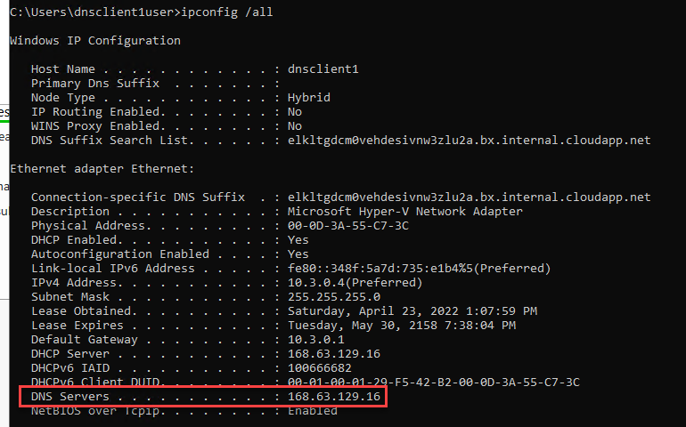
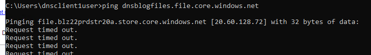
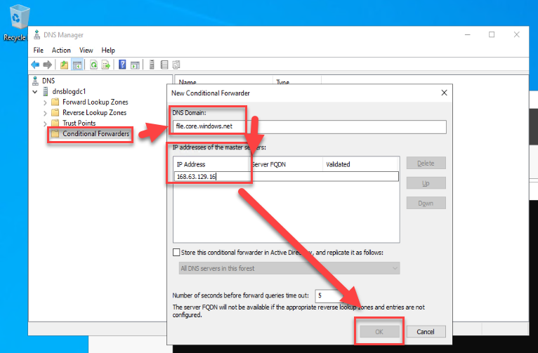
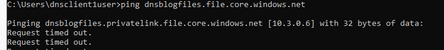

# Private DNS in Azure - It's always DNS

## It's Always DNS

As system administrators well know, DNS matters. If you doubt this, just Google "It's always DNS" and you will find no shortage of r/sysadmin stories explaining how it is always DNS. This does not change in Azure, especially if your Azure environment still includes Active Directory. My goal with this article is to give you an overall view of the private DNS story in Azure - what happens and what you can do within your vNets. Understanding this is critical for success with administering services such as Private Link, which is critical for configuration of secure environments and while the documentation does a good job of covering specific services and options, I have not seen a good synthesis/overall explanation. That is what I aim for here.

## TL;DR

Azure provides limited native private DNS capability for VMs. You can extend this with Private DNS zones, which the configuration of Private Link tries to help you with. Only if you have your AD extended to Azure and are thus not using that Azure-provided DNS you have to use a conditional forwarder or other methods to redirect the requests for services behind Azure Private Link back to that Azure-provided DNS.

## Out of the Box

If you run a "ipconfig /all" command inside an Azure VM newly deployed to a generic Azure vNet (this is what you get if you next-next-next the new VM wizard) you will get something like the below.

So DNS and DHCP are being provided by 168.63.129.16. [And if you Google "What is 168.63.129.16" you will get this article](https://docs.microsoft.com/en-us/azure/virtual-network/what-is-ip-address-168-63-129-16) the gist of which is "yep, this IP provides DNS and DHCP, and some critical platform communication elements." Outside of registering the names for the other hosts in the same vNet there is not a lot that this DNS service does for you ([details here](https://docs.microsoft.com/en-us/azure/virtual-network/virtual-networks-name-resolution-for-vms-and-role-instances#azure-provided-name-resolution)).

## Setting up your own DNS server, configuring clients

If you need more DNS functionality, or if you are extending your Active Directory environment to Azure, you are likely to find yourself setting up a domain controller, which is also a DNS server, in Azure. While it looks like you can make changes to the DNS server in network adapter settings in Windows as you would for an on-premises VM you should make these changes in the settings of the [VMs vNic](https://docs.microsoft.com/en-us/azure/virtual-network/virtual-network-network-interface#change-dns-servers) or the [vNet](https://docs.microsoft.com/en-us/azure/virtual-network/manage-virtual-network#change-dns-servers) for greater visibility. After making this change you will need to stop and start (deallocate and start, to use the precise terms) the Azure VMs you want the change to apply to, a simple reboot will not do.

## Private Link DNS considerations

This is all well and good. You now have your AD environment extended to Azure. You have potentially configured your DNS forwarders to whatever your default or policy is (DNS-based security solutions such as Cisco Umbrella are popular here), and moved on with life. But, for the sake of the scenario, you now need to set up an [Azure Files share](https://docs.microsoft.com/en-us/azure/storage/files/storage-files-introduction) (you are tired of file servers). You have an additional requirement of creating the most secure configuration possible. And you need to have this share be reachable from within your on-premises network as well (assume VPN connectivity via VPN gateway or similar). What do you do?

You use [Azure Private Link](https://docs.microsoft.com/en-us/azure/private-link/private-link-overview). As the name may suggest, this service creates a private IP connectivity to the Azure resources that support it, and there are many that do. You have now taken a service that is by default available for authenticated connections to form the whole internet and limited it only to accept connections from within your private IP address space. That secure enough?!

Only, if you next-next-next your way through the Private Link configuration you will find that private connectivity will be stubbornly unavailable within your AD-joined VMs that are using DCs as DNS servers. You will ping the name of your storage account and will get back a very obviously public IP address. Great.

But do not despair! Only a small part of the configuration is missing. By default, the Private Link wizard will create the required [Private DNS Zone](https://docs.microsoft.com/en-us/azure/dns/private-dns-overview), and will configure that zone with the information for the Private Link network adapter. The Private DNS zone resource essentially provides additional information for the default Azure DNS service that we discussed earlier, and these Private DNS zones are linked to specific vNets (this point is important if you need to extend this service to extra vNets. You need to link those vNets!) What it will not do, however, is tell your custom DNS infrastructure about this!  
That you can do in one of several ways:

1. Configure your DNS forwarders in Active Directory to point to 168.63.129.16. This probably will not fly in anything other than a lab environment, so is a non-option.
2. Use a hosts file. This is probably not suitable for anything other than testing.
3. Use a conditional forwarder to redirect the resolution requests for the services you are presenting via Private Link to Azure DNS, so the Private DNS zone configuration already created can function. This is the option we will investigate.

I first learned about conditional DNS forwarders when studying for the Server 2016 MCSA certification 6 years ago. Back then it was a nice thing to know about, certainly relevant for large and complex environments, but not for the smaller scale on which I was operating. Only about [2 years ago](https://azure.microsoft.com/en-us/updates/private-link-now-available-in-ga/), with the release of Private Link, did this knowledge become relevant. (This is also covered in the [new Hybrid certification](https://docs.microsoft.com/en-us/learn/certifications/windows-server-hybrid-administrator/) if you care about that sort of thing.)

The basic structure of a conditional forwarder is "for this domain, these are the servers to send requests to." Below is the configuration you would be looking to create specifically for Azure Files. The DNS Domain that you would forward depends on the service. And the IP address to forward to should be familiar – that is the internal Azure IP address we discussed earlier.

Now you should find that name resolution is behaving as expected for VMs in the cloud.

For clients on-premises, however, further changes are needed. If you reviewed the article about 168.63.129.16 you would have noticed that this IP address is reachable only from Azure. So, within your on-premises network you likewise must configure DNS forwarding, but to your DNS server in Azure rather than the Azure DNS IP.

## In Conclusion

Hopefully this article proves a useful introduction to handling private DNS in Azure. Please do not hesitate to reach out with feedback/comments!
