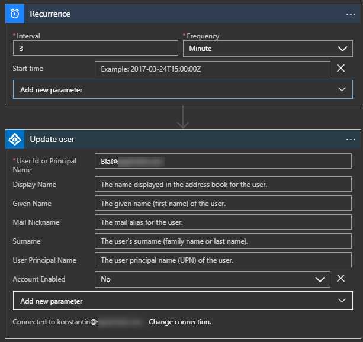

This morning I learned that the expiration status of an AD user is not synced to Azure AD by Azure AD Connect. [Apparently Microsoft is working on this](https://feedback.azure.com/forums/169401-azure-active-directory/suggestions/31459621-sync-account-expired-useraccountcontrol-to-azure), but that only means that this may be put in place eventually.

Until then, a Logic App is a simple and straightforward way of doing this. The Azure AD connector includes an Update user action, which exposes the relevant property. You can use the start time parameter on the Recurrence trigger to start this.

And, if you really wanted to, you could have the Logic App disable itself when it's done, but more on that later.

Picture is really worth a thousand words in this case!
