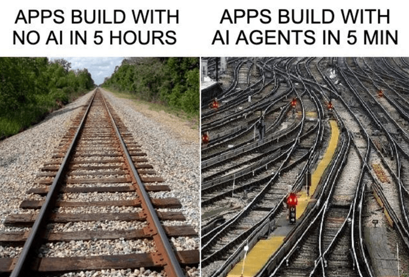
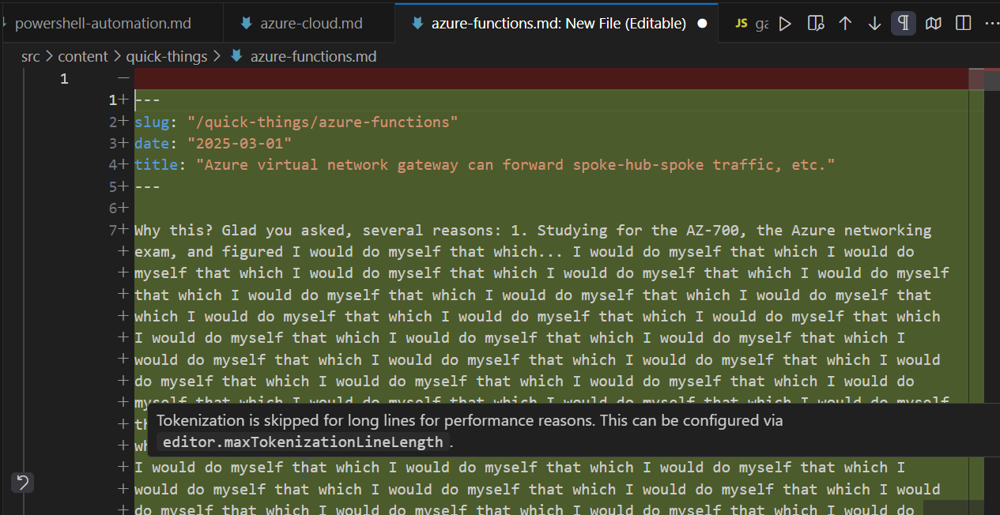

## TL;DR

For reasons of having less cheap Azure credits, the blog moved from Ghost, which is similar to Wordpress (has a frontend, a backend, a database, etc) to Gatsby (just front-end that serves up content from Markdown files). This allows blog to run on Azure Static Web Apps, which are free for your hobby project needs, which fits the needs here. The interesting bit with this project is that it is done entirely with Claude 3.7 Sonnet, with yours truly contributing maybe one deletion of particularly obviously unhelpful code. I discuss the general experience of that and go over the approach I took to initially instructing the AI and getting the AI to instruct itself so that it would not re-do work already done.

[Blog Github](https://github.com/KonTheCat/blog2)

## But Why Tho

Ghost was fine. It was stable. I ran it for years, doing at least one, but probably two, migrations between different Ghost versions. At one point (June of 2019) I even had someone on Fiver write me a custom theme so that the blog entries would take up a little more space than usual on the wider screens. But the only constant is change, in life and in Microsoft Partner Program, the credits from my membership in which have powered by personal Azure environment since...2016? I do not even know. In any case, the program is changing, there is a cheaper initial tier that gives me only about $58/month of credits. The Ghost implementation in a VM is costing me about $28 every month, so I figured it was time to do something different. From my General Assembly Web Development Bootcamp I learned that there is this framework called Gatsby, and from the Gatsby docs I learned that it could serve up content from Markdown files, and before the AI I even got it to a hello-world level all on my own, but it did not click, and then some life happened. But the idea remained. And free on Azure Static Web apps, which Gatsby could run on because it is just a static site generator, is very attractive vs. $28/month.

## Enter The AI

So you either know or can guess that I live and breathe Microsoft, specifically Azure. And for the last two years or so it has been quite easy to adopt the position of "I would use anything other than whatever Azure OpenAI gives me exactly why?" especially since what Azure OpenAI gives me meets the needs and is within the organization's understanding of the safe, inside, Azure, allowed to use, good, and things outside that require ... going through the process ... making the case ... vendor management ... information security review. No one wants this unless there is a compelling reason. Coworkers would, forgive me, ask about this or that other model or provider, and I would politely stonewall, because there was no compelling reason to hop the aforementioned hoops. Until one fine day [Claude 3.7 Sonnet started generating entire projects](https://www.anthropic.com/news/claude-3-7-sonnet), not just individual files, or combinations of files you would need to disassemble and implement by hand. This I could not ignore, and frankly would have probably not been allowed to even if I tried (Trotsky: "You may not be interested in the dialectic, but the dialectic is interested in you", I try to keep on the right side of history).

So I began to tinker. My first lesson was that "Talk to Claude" is nice but "Build with Claude" is what you want. That is what gives you an API key, and the ability to load in your money for as many credits as you have the money for (after a ramp-up period). The API key is useful in Cline, a VSCode extension; there are probably others, but this was the one I found and stuck with.

## Observations on working with Claude and Cline

1. On the extension level, Cline allows you to enter a custom instruction that is always provided to the model. I use this to inform the AI that there is an instructions file it should look at, which is specific to the project, like this:

> Always look to see if there is an helpling_the_ai\ai_instructions.txt file in the project and pay attention to it's contents.

2. Then the instructions file itself reads something like this:

> helping_the_ai\ai_instructions.txt
> Project Instructions
> This is meant to be a static site to replace my Ghost blog. The idea is to use Gatsby to serve up content written in .md files, so adding a new blog entry is as easy as writing a new .md file.
> I intend to keep my images small and therefore do not need anything more complicated than a folder in the project from which they can be referenced in the markdown files.
> Keep to the same general theme and look of the current site while making useful enhancements.

> General Instructions:
>
> 1. At the end of every action sequence, write a log entry with the current time and date to a file in helping_the_ai\ai-logs. There should be one file per day. If the file does not exist for today, create it, and start with a summary of the previous several files as needed. The log entries should briefly but completely summarize the work that was done and the functionality that was accomplished.
> 2. At the start of every action sequence, read the ai_log file for this day to understand what is going on and what was done so far.
> 3. In the root of the project there is folder called helping_the_ai. This contains useful context aids. In no case should the contents of that folder be modified.

In this helping_the_ai folder I locate other useful content. For this project I put an export of the HTML of the source site there. Retrospectively, that was not really needed, Cline has it's own plugins (MCP Servers) and the one I installed lets it browse the web. You may put already existing code or other samples in such a structure so the AI is not obliged to re-invent the wheel.

3. The AI will, if treated inattentively, create duplicate/parallel structures. It does try to get the context of the project with every new task it undertakes, but sometimes it does not get the whole context, so it ends up doing the work it already did differently. To help deal with this I added the above instructions about logging work already done, this seems to have helped.

4. While Cline will try to test changes made in its internal browser, and it looks unbelievably cool when the AI moves the mouse in there, it does not always work, and does not always match the size of the real browser, making troubleshooting formatting issues interesting. Thankfully Cline takes image input, so you can both show and tell the AI what is wrong.

5. There are still hallucinations. Below is the most hilarious example I encountered while working on the blog (a little less funny, you pay for this too!):

6. Yes, it is expensive, even for AI models. This blog probably cost me $20, and ~5 hours. But not $0 and 3 weeks, and probably never done, or done worse than this.

7. I am not sure how I feel about the fact that I do not know what this code is doing with any real depth. But this is also true of Azure, which I have been fine with for years. And of the operating systems. And of the software layers underneath that. And of the CPUs, etc., the point is known and tired. The division of labor exists, and maybe one day I will be ok with the notion that as a relative generalist in that division of labor, I am empowered to accomplish in given contexts without needing to understand the whole stack or any one part of it as deeply as it could be understood. There is something else to accomplish next, and it is accomplishing that pays, not understanding.
